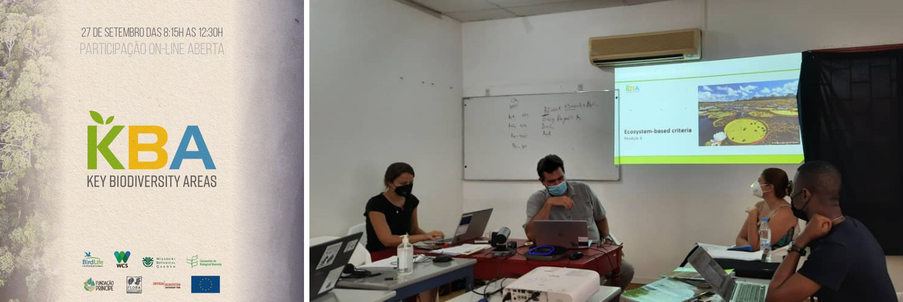
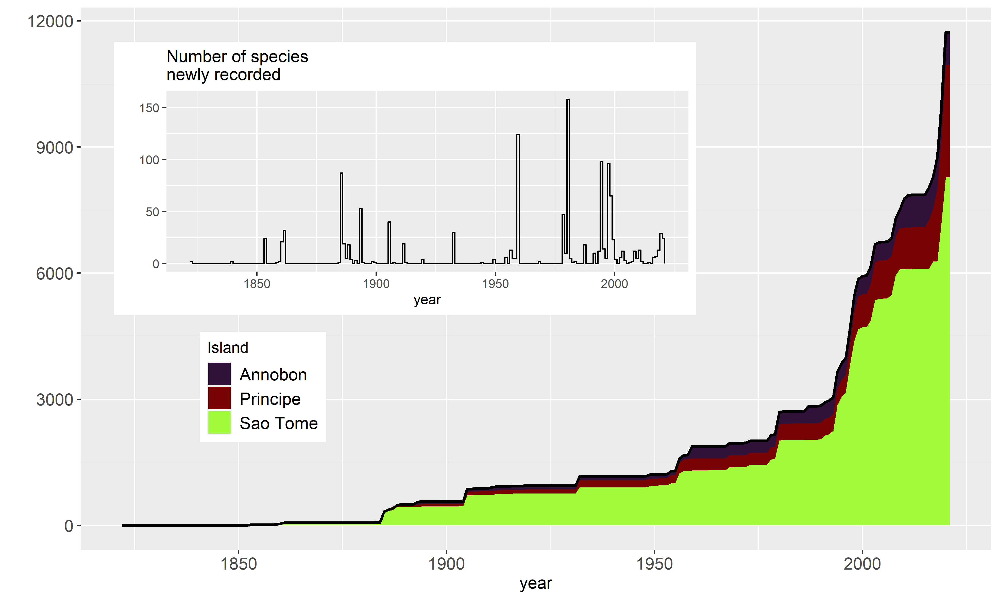

\vspace{-13truemm}

```{r, echo=F, include=T, message=F, warning=F}

# doc.type <- "local_rmd"
# title: \vspace{-1.5cm} Newsletters 4^[Find more information on the [WEBSITE](https://cepf-stp-threat-flora.netlify.app/#about)]
# \vspace{-0.2cm} October 2021 \vspace{-0.6cm}


doc.type <- "blog"
# library(leaflet)
# library(sf)

```

# Documenting the uniqueness of the Pico de São Tomé area
We conducted a botanical expedition at the Pico de São Tomé that revealed the uniqueness of the *Erica* vegetation belt occurring on ridges above 1 900 m. For the first time, vegetation inventories were conducted in the area, revealing that this unique ecosystem not only occupies a very restricted area, but also that it is heavily threatened by invasive species, whose abundance is the consequence of vegetation clearing and the plantation of *Cinchona* spp. during the first half of the 20 century. We estimate that up to 90% of the natural range of this habitat may already have been lost. One of the team botanist, Olivier Lachenaud, also collected and identified a new species of *Renealmia*, a giant herb belonging to the Ginger family, which is restricted to the zone above 1900 m altitude, i.e. an area of approximately 25 ha. The team also set out to document the abundance of *Balthasaria mannii*, a rare endemic tree species that was suspected to be extinct until a single individual was found during our inventories conducted at the beginning of the project in 2019. A total of just 15 individuals were found during our intensive field campaign, and moreover no seedlings were observed, which suggests that regeneration is poor or non-existent. These observations thus confirm our assessment that this species is Critically Endangered (submitted to the Red List). This ecosystem characterized by *Erica thomensis* vegetation and the unique flora it harbors urgently require both dedicated conservation actions and further studies to strengthen our understanding of its dynamics and resilience to environmental changes.

```{r, echo=F, out.width='80%', fig.align="center", fig.cap="The team that went to the Pico in September 2021"}
# if(doc.type=="local_rmd") knitr::include_graphics("D:/MonDossierR/stp_website_backup//static/img/team_pico.jpg")
if(doc.type=="blog") knitr::include_graphics("team_pico.jpg")
```

\vspace{-10truemm}

# Key Biodiversity Areas workshop
A workshop on Key Biodiversity Areas (KBAs) of São Tomé and Principe was held during five days in September 2021, organized by Birdlife International and numerous other partners, including Wildlife Conservation Society (WCS), Missouri Botanical Garden (MBG), Fundação Príncipe, Fauna & Flora International (FFI), Centro para Ecologia, Evolução e Alterações Ambientais (cE3c) da Universidade de Lisboa e Centro de Ecologia Funcional da Universidade de Coimbra. The first two days were dedicated to training provided by Eleuterio Duarte from WCS Mozambique. Then, the project team applied KBA criteria to plant species and other participants focused on faunal data, to document the existing network of KBAs and test hypotheses of new potential KBAs, such as the Ribeira Funda Valley (near Plancas community), which was identified as a possible KBA based on five plant species. For the first time, flora data were used in São Tomé and Príncipe to support the identification and characterization of KBAs, whose delineations has previously been based only on faunal data, especially birds.


```{r, echo=F, out.width='70%', fig.align="center", fig.cap="(Left) KBA workshop flyer. (Right) KBA workshop."}
# if(doc.type=="local_rmd") knitr::include_graphics("D:/MonDossierR/stp_website_backup//static/img/kba_news4.png")
if(doc.type=="blog") 
```

\vspace{-10truemm}

# Major advances in our knowledge of plant distribution and diversity

During the two years of the project, and despite many difficulties linked to the Covid pandemic, extensive inventories were conducted on both islands. The results significantly increased our knowledge of the flora of the country: more than 2900 collections were made (corresponding to ca. 20% of all georeferenced records ever collected in the archipelago), representing 370 species, of which more than 50 were recorded for the first time in the country and more than 20 are new to science. We also augmented the dataset of vegetation transects that already existed in Principe by establishing 38 new transects. Overall, a total of 50 vegetation transects have now been made in São Tomé forests (in addition to 50 transects in rural and urban areas), along with 56 transects on Principe, yielding very precise data on tree occurrences and abundances on the two islands, making it possible to provide a more informed estimate of risk of extension for the endemic plant species, while also identifying threatened habitats.


```{r, echo=F, out.width='100%', fig.align="center", fig.cap="Increase in number of collections (for São Tomé, Príncipe and Annobon separately) and species since 1850, highlighting the inventories conducted during the project"}
# if(doc.type=="local_rmd") knitr::include_graphics("D:/MonDossierR/stp_website_backup//static/img/sampling_trought_time.png")
if(doc.type=="blog") 
```


